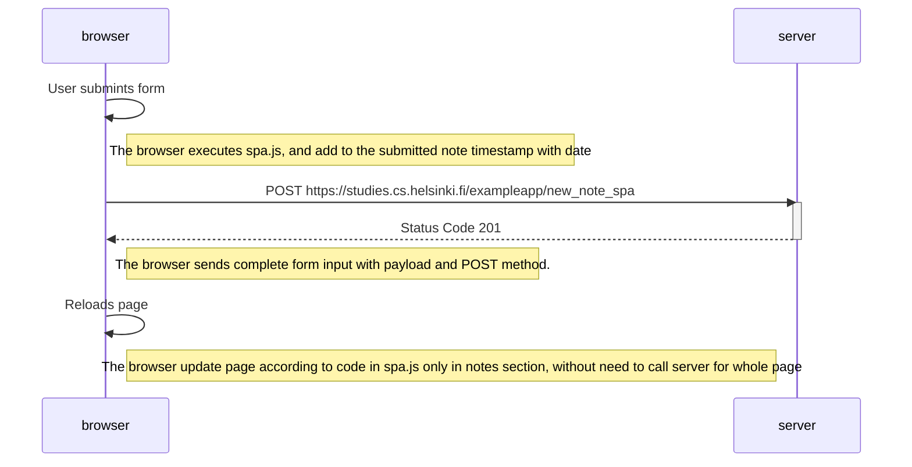

```mermaid
    sequenceDiagram
    participant browser
    participant server

    browser->>browser: User submints form

    Note right of browser: The browser executes spa.js, and add to the submitted note timestamp with date

    browser->>server: POST https://studies.cs.helsinki.fi/exampleapp/new_note_spa
    activate server
    server-->>browser: Status Code 201
    deactivate server

    Note right of browser: The browser sends complete form input with payload and POST method.

    browser->>browser: Reloads page 
    activate server

    Note right of browser: The browser update page according to code in spa.js only in notes section, without need to call server for whole page

```